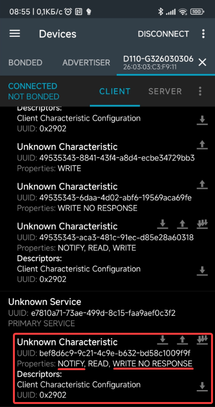

# Hardware interfacing

## Bluetooth

NIIMBOT printers have two bluetooth addresses.

In case of D110 :

* `26:03:03:c3:f9:11` - low energy
* `03:26:03:C3:F9:11` - classic

### Bluetooth Low Energy

You can interact with printer through a specific BLE characteristic.
To find what characteristic is suitable for this:

1. Find services which have UUID length > 4.
2. Find characteristic in these services which have `NOTIFY` and `WRITE_WITHOUT_RESPONSE` properties.

   

Unfortunately, this process is can't be done with Web Bluetooth API (you must set service UUID in filter before devices searching).
Anyway, most of NIIMBOT printers have characteristic `bef8d6c9-9c21-4c9e-b632-bd58c1009f9f` of service `e7810a71-73ae-499d-8c15-faa9aef0c3f2`.
NiimBlueLib uses these UUIDS for interfacing.

If you found characteristic, you can subscribe for notifications to get responses from the printer.
To send data, write a value without response.

### Bluetooth Classic

Use bluetooth serial.

## Serial (USB)

Packet format is same as Bluetooth. The only problem is that packets may be fragmented.

For example, packet `5555d9091f90044c000001000016aaaa` can be received as `5555d9091f90044c000001000016` `aaaa`.
