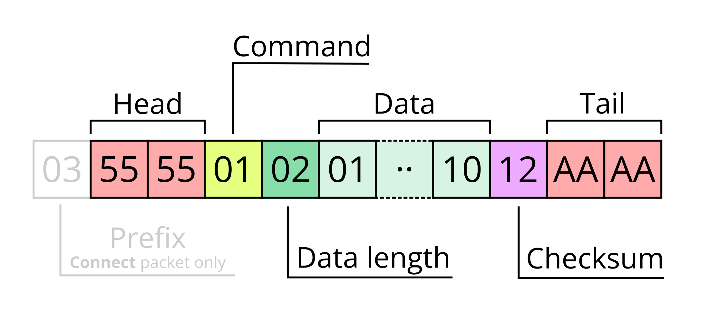
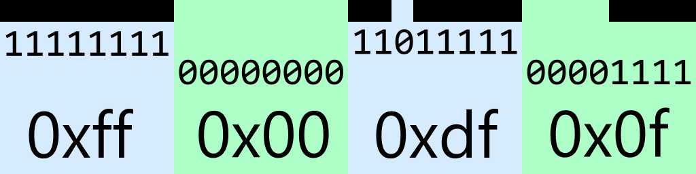

WIP

# NIIMBOT printers protocol

## Packet structure



* **Prefix** - prefix `0x03` is present in only one command - **Connect**.
* **Head** - always 2 bytes (`0x55` `0x55`).
* **Command** - command (packet) identifier.
* **Data Length** - number of bytes of data.
* **Data** - data with **Data length** length.
* **Checksum** - calculated by XOR of all bytes from **Command** to the last byte of **Data** (inclusive).
* **Tail** - always 2 bytes (`0xAA` `0xAA`).

## List of packets

| Request ID | Name | Response ID(s) | [Simple](#simple-packet) |
|------|------------|------|-|
| 0x01 | PrintStart | 0x02 |✅|
| 0x03 | PageStart | 0x04 |✅|
| 0x05 | PrinterLog | 0x06 |✅|
| 0x0b | AntiFake | 0x0c |✅|
| 0x13 | SetPageSize | 0x14 | |
| 0x15 | PrintQuantity | 0x16 | |
| 0x1a | RfidInfo | 0x1b |✅|
| 0x1c | RfidInfo2 | 0x1d |✅|
| 0x20 | PrintClear | 0x30 |✅|
| 0x21 | SetDensity | 0x31 | |
| 0x23 | SetLabelType | 0x33 | |
| 0x27 | SetAutoShutdownTime | 0x37 | |
| 0x28 | PrinterReset | 0x38 |✅|
| 0x40 | PrinterInfo | 0x4f, 0x47, 0x4d, 0x4a, 0x41, 0x4c, 0x43, 0x46, 0x48, 0x4b, 0x49, 0x42 | |
| 0x54 | RfidSuccessTimes | 0x64 |✅|
| 0x58 | SoundSettings | 0x68 | |
| 0x59 | CalibrateHeight | 0x69 | |
| 0x5a | PrintTestPage | 0x6a |✅|
| 0x70 | WriteRFID | 0x71 | |
| 0x83 | [PrintBitmapRowIndexed](#printbitmaprowindexed) | ⚠ one way | |
| 0x84 | [PrintEmptyRow](#printemptyrow) | ⚠ one way | |
| 0x85 | [PrintBitmapRow](#printbitmaprow) | ⚠ one way | |
| 0x8e | LabelPositioningCalibration | 0x8f |✅|
| 0xa3 | PrintStatus | 0xb3 |✅|
| 0xa5 | PrinterStatusData | 0xb5 |✅|
| 0xaf | PrinterConfig | 0xbf | |
| 0xc1 | Connect | 0xc2 |✅|
| 0xda | CancelPrint | 0xd0 |✅|
| 0xdc | Heartbeat | 0xde, 0xdf, 0xdd, 0xd9 | |
| 0xe3 | PageEnd | 0xe4 |✅|
| 0xf3 | PrintEnd | 0xf4 |✅|

## Packet details

### Simple packet

This packet has `Request ID`, `Data length=1`, and `Data=1`.

Checksum will be same as `Request ID` because `N^1^1 == N`.

Example (RfidInfo):

```
55 55 1a 01 01 1a aa aa
       │  │  │  │
       │  │  │  └─ Checksum (1a^01^01)
       │  │  └─ Data
       │  └─ Data length
       └─ RfidInfo command
```

## Packet details (image data packets)

See [print tasks](niimbot_print_tasks.md) to understand how to images are printed.

### PrintEmptyRow

Used to fill row with blank (white) pixels.

Example:

```
55 55 84 03 00 04 02 81 aa aa
       │  │  └──┤  │  │
       │  │     │  │  └─ Checksum
       │  │     │  └─ Repeat count (repeat row two times)
       │  │     └─ Row number is 4
       │  └─ Data length
       └─ PrintEmptyRow command
```

### PrintBitmapRowIndexed

Used when black pixel count is less than 7. Data is encoded with pixel indexes (unsigned 16-bit integers).

`Black pixel count` segment is a mystery. It encoded with 3 bytes. Sum all of them equals total count of current row black pixels.

Algorithm of this segment calculation you can see in {@link API.Utils.countPixelsForBitmapPacket} source code.
Sometimes result match the original packets, sometimes not.

Usually printer prints without problems when all of 3 bytes are zeros.

Example:

```
55 55 83 0a 00 03 02 00 00 02 00 0a 01 40 c1 aa aa
       │  │  └──┤  └──┴──┤  │  └──┤  └──┤  │
       │  │     │        │  │     │     │  └─ Checksum
       │  │     │        │  │     │     └─ Draw pixel at x=320
       │  │     │        │  │     └─ Draw pixel at x=10
       │  │     │        │  └─ Repeat count (repeat row two times)
       │  │     │        └─ Black pixel count (see above)
       │  │     └─ Row number is 3
       │  └─ Data length
       └─ PrintBitmapRowIndexed command
```

### PrintBitmapRow

Used to send full row segment that includes both black and white pixels.

Image row example:



Packet example:

```
55 55 85 0a 00 00 13 00 00 01 ff 00 df 0f b2 aa aa
       │  │  └──┤  └──┴──┤  │  └──┴──┴──┤  │
       │  │     │        │  │           │  └─ Checksum
       │  │     │        │  │           │
       │  │     │        │  │           └─ Draw 32 pixels (19 black, 13 empty)
       │  │     │        │  └─ Repeat count (repeat row 1 time)
       │  │     │        └─ Black pixel count (19)
       │  │     └─ Row number is 0
       │  └─ Data length
       └─ PrintBitmapRow command

```

## Other packets example

* `55 55 40 01 0b 4a aa aa` - get device serial number
* `55 55 1a 01 01 1a aa aa` - get rfid data
* `55 55 58 03 01 01 01 5a aa aa` - enable Bluetooth connection sound
* `55 55 58 03 01 01 00 5b aa aa` - disable Bluetooth connection sound
